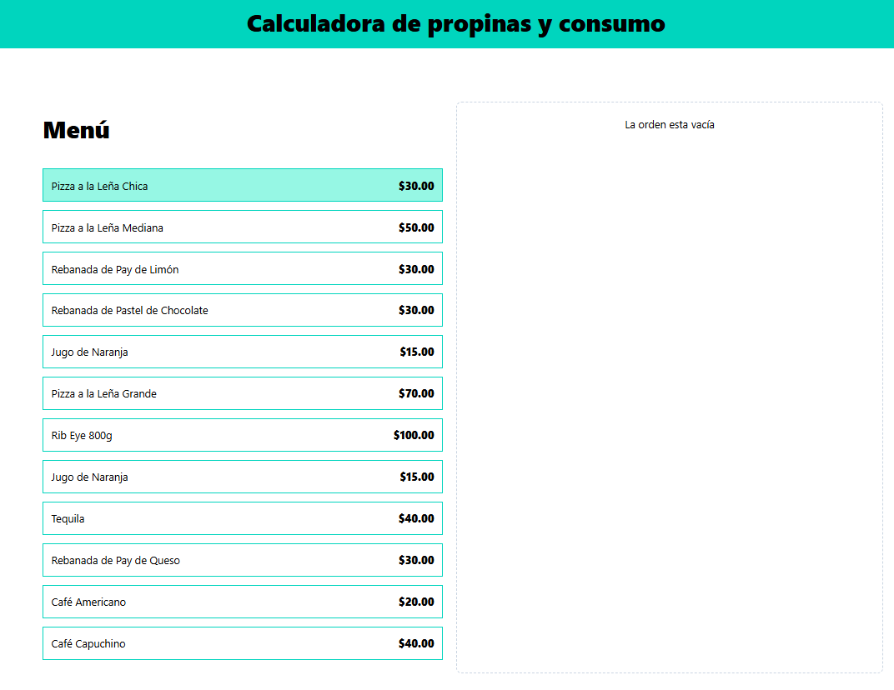
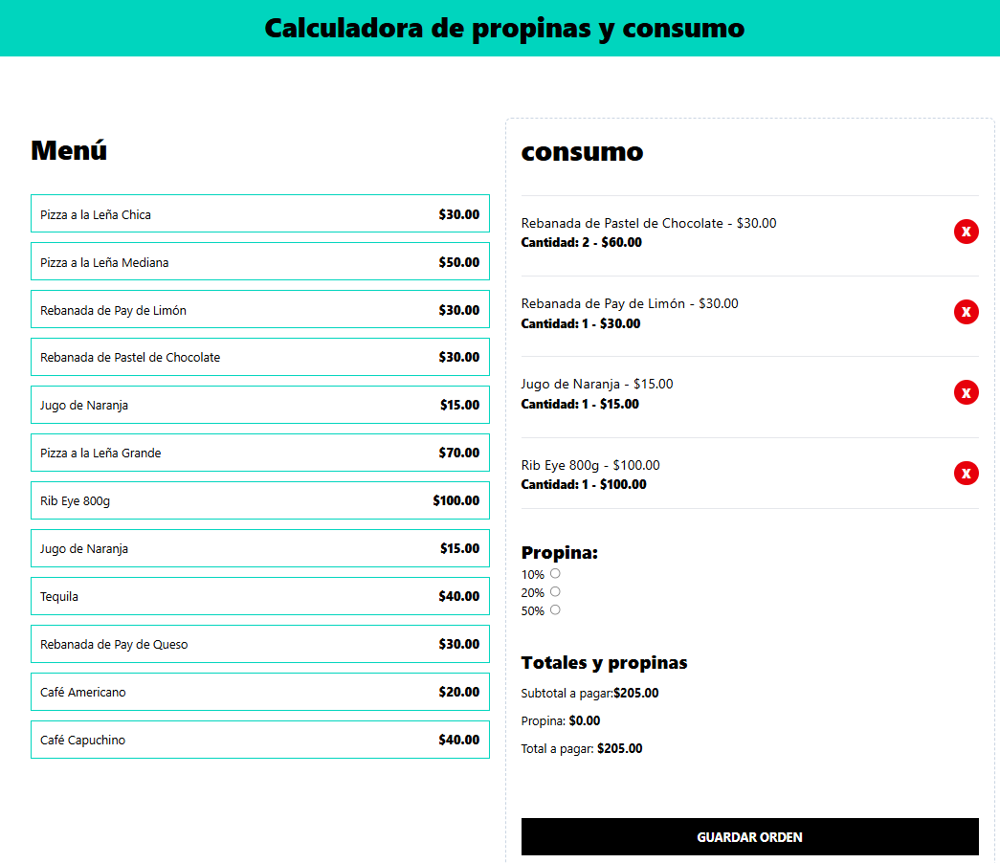

# Menú para restaurantes en React | Proyecto Final

[](https://github.com/tu-usuario/tu-repo)
[](https://tuni.edu.mx)
[](https://github.com/tu-usuario/tu-repo)
[](https://github.com/LHeriberto-21/ReactCalculadora.git)

## React + TypeScript + Vite

Esta plantilla proporciona una configuración mínima para que React funcione en Vite con HMR y algunas reglas ESLint.

Actualmente, hay dos complementos oficiales disponibles:

- [@vitejs/plugin-react](https://github.com/vitejs/vite-plugin-react/blob/main/packages/plugin-react) utiliza [Babel](https://babeljs.io/) para la actualización rápida
- [@vitejs/plugin-react-swc](https://github.com/vitejs/vite-plugin-react/blob/main/packages/plugin-react-swc) utiliza [SWC](https://swc.rs/) para la actualización rápida

## Compilador de React

El compilador React actualmente no es compatible con SWC. Consulte [este problema](https://github.com/vitejs/vite-plugin-react/issues/428) para seguir el progreso.

## 📖 Descripción del proyecto

Proyecto final sobre una calculadora de consumo, donde simula un restaurante y la cuenta de todo el consumo que solicitó.  
Desarrollado como parte de la materia **Programación Web 1** durante el semestre **2026-IDS-N81** en **Universidad Tecnológica de Baja California**.

**Dirección en producción:**
[Quires verlo en produccion? Da click aquí](https://calculator-consum.netlify.app/)

**¿Qué lo hace diferente?**

- Renderización de componentes de lo que solicite el usuario
- Creacion de Custom Hooks para separar la logica de las implementaciones, diseño responsive

## Demostración rápida en producción




## Tecnologías usadas

| React | Prettier | JavaScript | TypeScript | GitHub |
| ----- | --------- | ----------- | ---------- | ------ |
|  |  |  |  |  |

## Instalación y ejecución (en menos de 2 minutos)

```bash
# crear una folder para las herramientas a usar
mkdir ReactCalculadora

# Entrar a la carpeta que se creó
cd ReactCalculadora

# crear un proyecto con vite
npm create @vite/latest

# instalar dependencias estando dentro de la carpeta en donde se instalarán las dep
npm install

# Comenzar con el servidor con Vite
npm run dev
```
